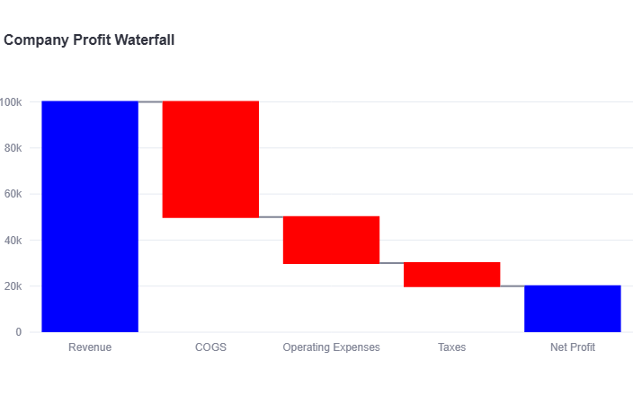
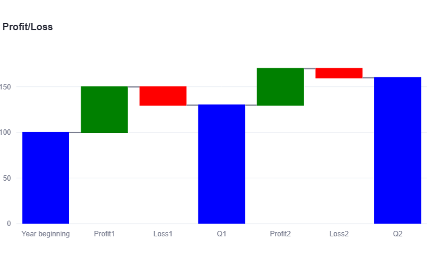
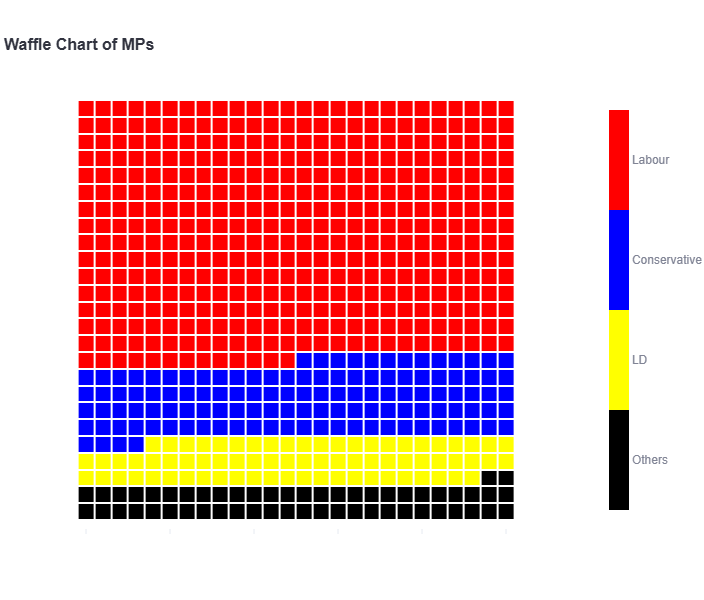
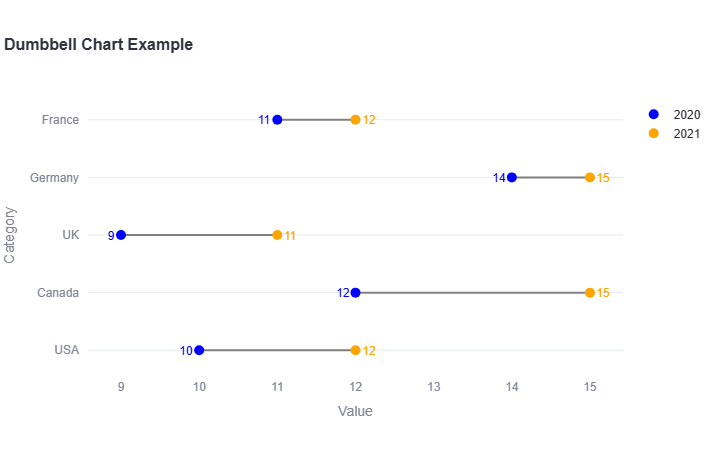
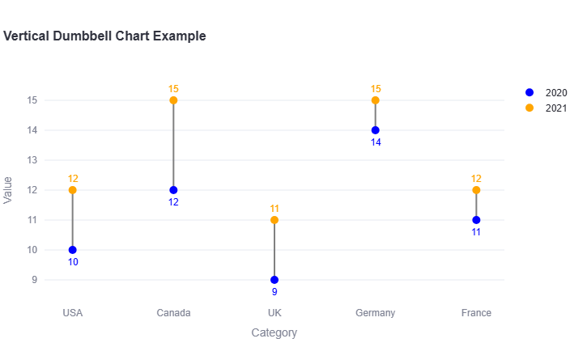
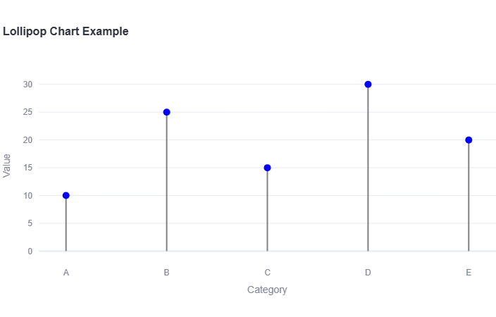
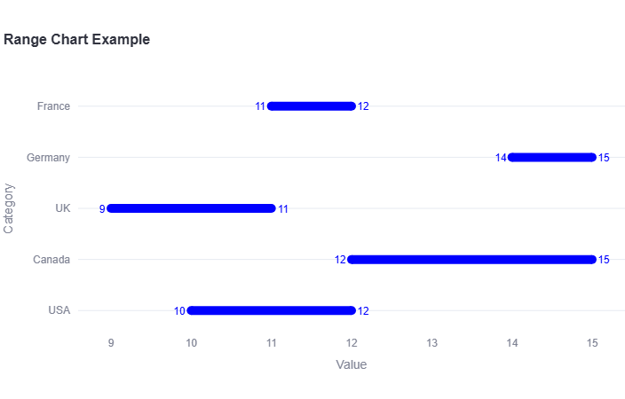
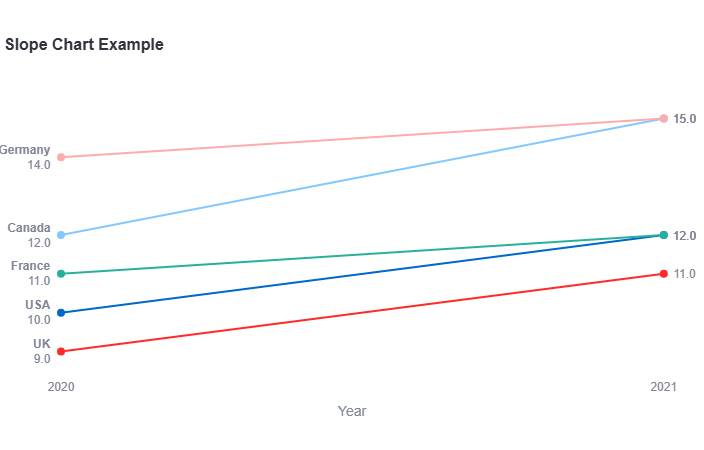

# px_xtras2 - a Plotly Helper Library

[](https://opensource.org/licenses/MIT)

An advanced plotting library for Plotly that provides a collection of helper functions to create beautiful and informative visualizations with ease. This library simplifies the process of generating complex charts like waterfall, waffle, and dumbbell charts, allowing you to focus on your data and insights.

## Overview

This library provides functions for creating the following advanced chart types:

*   **Waterfall Chart:** Ideal for visualizing the cumulative effect of sequential positive and negative values.
*   **Waffle Chart:** Perfect for displaying progress toward a goal or the composition of a whole.
*   **Dumbbell Chart:** A great way to compare two data points and visualize the change between them.
*   **Lollipop Chart:** A visually appealing alternative to a bar chart, useful for showing the relationship between a numeric and a categorical variable.
*   **Range Chart**: Similar to a dumbbell chart with a different aesthetic
*   **Slope Chart**: A simplified line chart for easy comparison of two variables
*   **Metric**: a non-graphic representation of a changing value


## Installation

To install *px_extras*, you can use pip:

```bash
pip install git+https://github.com/alanjones2/px-xtras2.git
```
Or download the library from the repo and drop it into your project.

## Usage

Here are some examples of how to use the library to create different types of charts - the examples are configured as Streamlit apps.

To run the apps you need to do the following imports:

```python
import streamlit as st
import pandas as pd
import px_xtras as ph
```
Below are images of the available charts. The code to create them can be found in the file [stdemo.py](stdemo.py).

### Waterfall Charts





### Waffle Chart




### Dumbbell Chart




### Vertical Dumbbell Chart



### Lollipop Chart



### Range chart



### Slope chart



### Metric


## API Reference

### `waterfall()`

Creates a waterfall chart.

**Parameters:**

*   `df` (pd.DataFrame): DataFrame containing the data.
*   `categories_col` (str): Name of the column for categories.
*   `values_col` (str): Name of the column for values.
*   `measure_col` (str): Name of the column for the measure type.
*   `title` (str, optional): Title of the chart.
*   `measure` (List[str], optional): List specifying whether each data point is 'relative' or 'total'.
*   `color` (str, optional): A common color for all elements.
*   `**kwargs`: Additional keyword arguments passed to `fig.update_layout()` (e.g., `width`, `height`, `template`).

### `waffle()`

Creates a waffle chart.

**Parameters:**

*   `df` (pd.DataFrame): DataFrame containing the data.
*   `categories_col` (str): Name of the column for categories.
*   `values_col` (str): Name of the column for values.
*   `title` (str, optional): Title of the chart.
*   `local_colors` (List[str], optional): A list of colors for the categories.
*   `**kwargs`: Additional keyword arguments passed to `fig.update_layout()` (e.g., `width`, `height`, `template`).

### `dumbbell()`

Creates a dumbbell chart.

**Parameters:**

*   `df` (pd.DataFrame): DataFrame containing the data.
*   `categories_col` (str): Name of the column for categories.
*   `values1_col` (str): Name of the column for the first value set.
*   `values2_col` (str): Name of the column for the second value set.
*   `label1` (str, optional): Label for the first value set.
*   `label2` (str, optional): Label for the second value set.
*   `title` (str, optional): Title of the chart.
*   `orientation` (str, optional): 'h' for horizontal (default), 'v' for vertical.
*   `**kwargs`: Additional keyword arguments passed to `fig.update_layout()` (e.g., `width`, `height`, `template`).

### `lollipop_chart()`

Creates a lollipop chart.

**Parameters:**

*   `df` (pd.DataFrame): DataFrame containing the data.
*   `categories_col` (str): Name of the column for categories.
*   `values_col` (str): Name of the column for values.
*   `title` (str, optional): Title of the chart.
*   `stick_color` (str, optional): Color for the lollipop sticks.
*   `marker_color` (str, optional): Color for the lollipop markers.
*   `**kwargs`: Additional keyword arguments passed to `fig.update_layout()` (e.g., `width`, `height`, `template`).

### `line_range()`

Creates a line range chart.

**Parameters:**

*   `df` (pd.DataFrame): DataFrame containing the data.
*   `categories_col` (str): Name of the column for categories.
*   `values1_col` (str): Name of the column for the first value set.
*   `values2_col` (str): Name of the column for the second value set.
*   `title` (str, optional): Title of the chart.
*   `orientation` (str, optional): 'h' for horizontal (default), 'v' for vertical.
*   `**kwargs`: Additional keyword arguments passed to `fig.update_layout()` (e.g., `width`, `height`, `template`).

### `metric()`

Creates a metric component.

**Parameters:**

*   `title` (str): Label or title of the metric.
*   `value` (float | str): Main metric value.
*   `delta` (float | str): Optional delta/change value.
*   `**kwargs`: Additional keyword arguments passed to `fig.update_layout()` (e.g., `width`, `height`, `template`).

### `slope_chart()`

Creates a slope chart.

**Parameters:**

*   `df` (pd.DataFrame): DataFrame containing the data.
*   `categories_col` (str): The name of the column to be used for the x-axis.
*   `values_cols` (List[str]): A list of column names to be plotted on the y-axis.
*   `title` (str, optional): The title of the chart.
*   `**kwargs`: Additional keyword arguments passed to `fig.update_layout()` (e.g., `width`, `height`, `template`).

## License

This project is licensed under the MIT License.

## History

v.0.1.0 initial version
